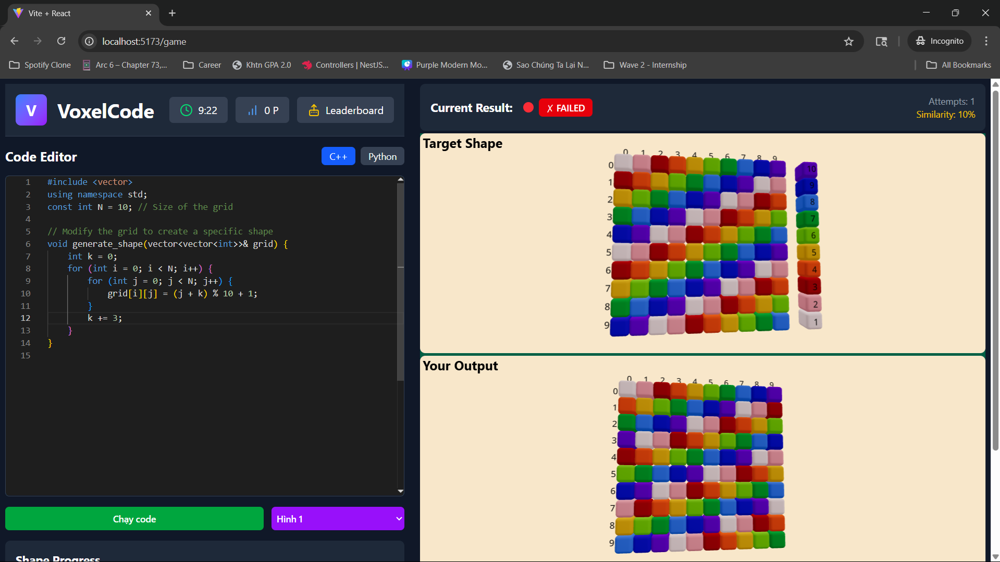

# VoxelCode



## Overview
"Voxel Code" is an intellectual programming game that challenges contestants to use their programming skills to recreate 2D voxel blocks. The game is designed to test contestants' logical thinking, creativity, and programming abilities in solving spatial geometry problems.

**Main Objective:** Contestants must write source code in C++ or Python to recreate a 2D block (simulated block) that perfectly matches the original block (problem statement) in terms of both the position and color of each voxel.

**Voxel Characteristics:**
*   A 2D block has a precise size of **10x10**, consisting of 100 voxels.
*   Each voxel is identified by its `(x, y)` coordinates. Coordinates start from `0`, indexed from top to bottom (`y`) and left to right (`x`).
*   Each voxel has a color, represented by an integer from **1 to 10** (corresponding to 10 different colors).
*   A color value **≤ 0** indicates an empty voxel and is not displayed.
*   Colors are ordered from 1 to 10.

**Game Interface:**
The main interface consists of three areas:
1.  **Code Editor:** Area for contestants to write their source code. A function template is provided. Contestants must complete this template to return a 2D matrix as described in the problem.
2.  **Problem Display Tab:** Shows the original block in a 3D view for contestants to reference.
3.  **Result Display Tab:** Shows the simulated block generated from the contestant's code, along with a comparison result against the original block.

**Frontend Routes**
- **/**: log in as player or host
- **/audience**: for watching players' current shapes in semi-realtime
- **/showcase**: for revealing the original shape and players' shapes (reachable via /audience)
- **/leaderboard**: for the game results (reachable via /showcase)

## Setup

Clone the repository and install dependencies for both client and server:

```bash
git clone https://github.com/yourusername/voxelcode.git
cd voxelcode

# Setup client
cd client
npm install

# Setup server
cd ../server
npm install
```

## Build

Build both the client and server (if applicable):

```bash
# Build client
cd client
npm run build

# Build server
cd ../server
npm run build
```

## Running the Project

Start the server and client in separate terminals:

```bash
# Terminal 1: Start server
cd server
npm run dev

# Terminal 2: Start client
cd client
npm run dev
```

## Clean Data

Before starting a new game, remember to clear all the data files in the folder ./data/currentShape and ./data/outputShape. These are previous data that will be displayed for audience view. 

## Configuration

- [Describe any configuration files or environment variables needed, e.g., `.env` files.]

## Authors
- [Coding Challenge 2025]
- Authors: [Huỳnh Anh Huy](https://github.com/anhhuy007) | [Trần Nguyễn Phúc Khang](https://github.com/PhKhang)
